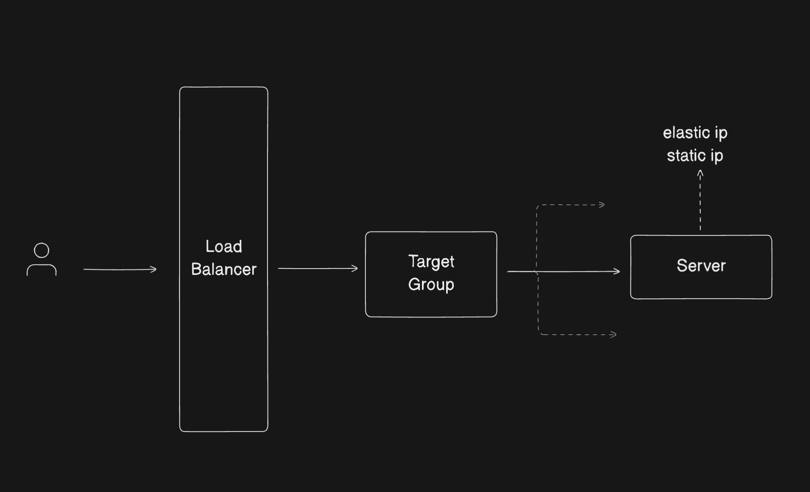

This repository contains a work-in-progress implementation of a Scalable Retrieval-Augmented Generation (RAG) system. The project is designed to handle file uploads and processing through a FastAPI backend, with MongoDB for data storage.

## Architecture


## AWS Deployment


## DevContainer Configuration

The project uses VS Code's DevContainer feature for development, providing a consistent and isolated environment. The configuration includes:

### Docker Images

1. **Base App Image**:

   - Built from `mcr.microsoft.com/devcontainers/python:3.12`
   - Includes Python 3.12 and additional tools like poppler-utils

2. **MongoDB**:

   - Official MongoDB image
   - Configured with admin credentials
   - Data persisted through a Docker volume

3. **Valkey**:
   - In-memory database (Redis compatible)
   - Exposed on port 6379
   - Data persisted through a Docker volume

### VS Code Extensions

The devcontainer comes with several pre-configured extensions for Python development, including code formatting, linting, and Docker tools.

## Application Components

### Python Server (app/main.py)

A simple entry point that initializes and runs the FastAPI server using Uvicorn on port 8000.

```python
# Initializes the FastAPI application and runs it with Uvicorn
# Configured to listen on all interfaces (0.0.0.0) on port 8000
```

### FastAPI Server (app/server.py)

The main web server that handles:

- Health check endpoint (`GET /`)
- File upload endpoint (`POST /upload`)

The file upload process:

1. Creates a UUID for the file
2. Stores file metadata in MongoDB with "saving" status
3. Saves the uploaded file to disk in `/mnt/upload/{file_id}/{filename}`
4. Updates the MongoDB record with "queued" status
5. Returns the file ID to the client

### Database (MongoDB)

MongoDB serves as the primary data store for the application with the following components:

- **Client Configuration**: Connects to the MongoDB instance defined in the Docker Compose setup
- **Database**: Uses a database named "mydb"
- **Collections**:
  - `files`: Stores metadata about uploaded files, including name and processing status

### Utility Functions

- **File Handling**: The `save_to_disk` function in `app/utils/file.py` handles asynchronous file writing with proper directory creation

## Running the Application

The repository includes two utility scripts:

- `run.sh`: Starts the FastAPI server with hot-reloading enabled
- `freeze.sh`: Generates a requirements.txt file based on the current Python environment


```bash
rq worker --with-scheduler --url redis://valkey:6379
```

## Production Deployment

### Docker Compose Production

The project includes a production-ready Docker Compose configuration (`docker-compose-prod.yml`) that sets up:

- FastAPI application with Gunicorn workers
- MongoDB with proper authentication
- Valkey (Redis-compatible) for task queue
- RQ worker for background task processing
- Proper volume mounting for data persistence
- Environment variable configuration for production settings

To deploy in production:

```bash
docker-compose -f docker-compose-prod.yml up -d
```

### Why We Built It This Way

This RAG system was designed with several key principles in mind:

1. **Scalability**: The architecture separates concerns between web serving, background processing, and data storage, allowing each component to scale independently.

2. **Reliability**: Using MongoDB for metadata storage and Valkey for task queuing ensures data persistence and reliable task processing.

3. **Developer Experience**: The DevContainer setup provides a consistent development environment, making it easy for developers to get started.

4. **Production Readiness**: The production Docker Compose configuration includes proper security settings, logging, and monitoring capabilities.

### AWS Deployment

The system can be deployed on AWS using the architecture shown in the diagram above. Key components include:

1. **EC2 Instances**:
   - Application servers running the FastAPI application
   - Worker nodes for processing RQ tasks
   - Auto-scaling groups for handling varying loads

2. **Amazon DocumentDB**:
   - MongoDB-compatible database service
   - Handles metadata storage and file information

3. **Amazon ElastiCache**:
   - Redis-compatible caching layer
   - Manages task queues and session data

4. **Amazon S3**:
   - Stores uploaded files and processed documents
   - Provides scalable and durable storage

5. **Amazon CloudFront**:
   - CDN for serving static content
   - Improves global access performance

6. **Amazon Route 53**:
   - DNS management
   - Load balancing across regions

The deployment is managed through infrastructure-as-code using AWS CDK, making it easy to replicate and maintain across different environments.
